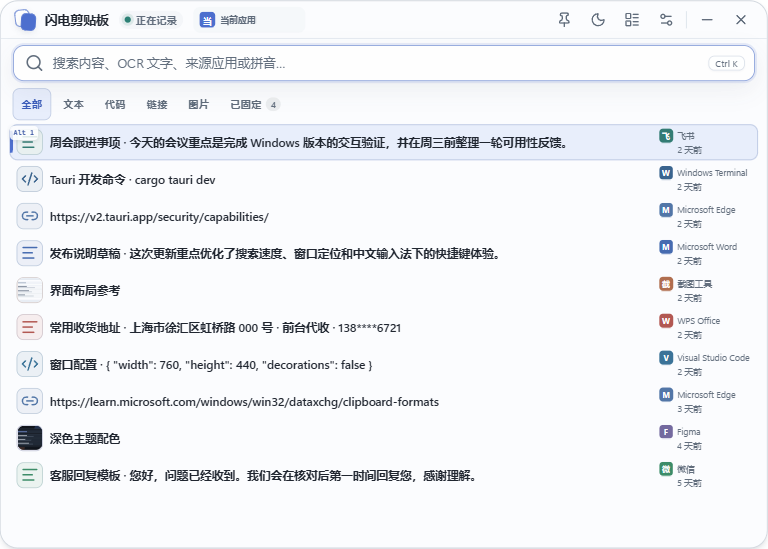

# QuickPaste（闪电剪贴板）

**闪电剪贴板 QuickPaste** 是一款专为 Windows 打造的剪贴板历史管理工具，主打一个“快”字。
`Ctrl + Shift + V` 一键唤起，搜索结果保留原文并高亮命中，选中后自动帮你切回原来的输入框完成粘贴——
把“复制 → 切窗口 → 粘贴”一步搞定。支持中文、拼音、来源与类型组合搜索，历史正文只存在本机
SQLite 中；没有云同步或远程遥测。

> 当前版本：[`0.20.0` GitHub Release](https://github.com/zkwi/QuickPaste/releases/tag/v0.20.0)。请只从该 Release 下载严格命名的 Windows x64 NSIS 安装包或绿色版 ZIP。

## 界面预览

### 快速面板



### 设置页面


## 当前能力

- 监听 Windows 文本、HTML/RTF 富文本、图片及 `CF_HDROP` 文件/多文件剪贴板；Office 等复杂对象保留可安全读取的标准表示，并明确标记未持久化的不透明 OLE/注册格式；文件记录只保存路径和元数据，不复制原文件。
- 同一条富文本记录保留 plain text、HTML 与 RTF，可明确选择“保留格式粘贴”或“纯文本粘贴”；图片和多文件也按原生类型写回。
- 文本、代码、链接、图片和文件使用统一的类型化动作规则：链接显式打开、图片另存为、文件打开/定位，缺失文件安全禁用。
- SQLite FTS5 支持中文子串、拼音/首字母、OCR、文件名、正文和来源应用搜索，中文单字/双字使用有界短词索引，并可组合类型、集合和固定状态筛选；快速面板输入 `;`/`；` 只看永久片段，输入 `@` 可从来源建议中快速限定微信、飞书、WPS 或浏览器等应用；结果使用稳定游标分页。
- 固定、删除和撤销；单层集合、可编辑永久文本/代码片段，以及管理页跨页批量固定、移动和删除。
- 按记录数量、图片逻辑字节数和保留期限共同裁剪普通历史；固定项与永久片段不参与自动裁剪。
- 设置页只展示数据库总占用（MB）和数据条数两项核心指标，同时保留数据目录直达、安全压缩、SQLite 备份、原子恢复及损坏数据库隔离恢复。
- 对已进入历史的剪贴板图片默认启用 Windows 本地 OCR，可随时关闭；会优先选择系统已安装的简体中文识别器并在引擎升级后安全重跑旧结果，识别文字可在预览中直接复制或粘贴，不下载或捆绑模型，也不上传图片或识别文字。
- 图片预览会在本机尝试识别二维码；结果可直接复制，只有经过安全校验的 HTTP/HTTPS 链接才提供系统打开入口，图片和结果均不上传。
- 代码预览按需加载 `highlight.js` core 与命中的语言模块；失败或超限时回退为转义纯文本，不向快速面板加入代码工具箱。
- 默认使用 `Ctrl + Shift + V` 唤起；快速面板优先读取系统辅助功能报告的文本插入点并靠近其右下方，同时受当前显示器工作区约束，目标应用不提供有效插入点时再回退到鼠标位置。
- 记住并复核原顶层窗口与实际输入焦点子窗口，恢复目标后自动回贴；目标失效或修饰键未释放时安全降级为仅复制。
- 管理员窗口使用带时限、进程互认且绑定剪贴板版本的一次性 UAC helper，目标请求不落盘；主程序若被以管理员身份启动会提示并退出。
- Enter、双击和 Alt + 数字快速粘贴；其中双击成功使用的记录会成为最新记录并移动到列表首位。快速面板在原有行高内默认显示最多两行有效摘要，拼音或首字母通过索引命中时也继续展示正文摘要；管理页合并重复标题与正文，减少无效重复。搜索框内置 `@来源`、`;永久片段`、预览与粘贴快捷键帮助。鼠标在被截断的文本或图片记录上稳定停留后会显示有界长文本或大图预览，且滚动、按键、失焦时立即关闭，不改变键盘焦点与选中项；Alt 数字徽标只跟随键盘选中项。支持键盘导航和中文输入法组合态保护，设置页会提示常见粘贴快捷键语义冲突。
- 浅色/深色主题、紧凑快速面板、管理页、设置页，以及可跳过且不改写系统剪贴板的首次快捷粘贴练习。
- 简体中文为默认语言，主要界面可即时切换英文。
- SQLite 是桌面历史的唯一真值；增量 CRUD 避免每次变化重写全库，大载荷只在预览或粘贴时按需读取。
- 安装版和绿色版都把数据库、WAL 与 SHM 保存在 `QuickPaste.exe` 同级的 `data` 文件夹；完全退出 QuickPaste 后复制整个文件夹即可迁移。开发阶段旧目录不会自动读取或迁移。
- 入站载荷采用明确硬边界：plain text、HTML 和 RTF 单格式最多 8 MiB；图片源及持久化图片最多 64 MiB、单边最多 8192 像素且不超过 4000 万像素。超限的附加格式会被明确省略，异常持久化正文会在复制进内存前被拒绝。
- 每天第一次启动时后台检查 GitHub Release，同日后续启动不重复请求；也可在设置页或托盘随时手动检查。发现新版后会在右下角弹出可操作通知，点击“下载安装”即可自动下载、核对 GitHub SHA-256 摘要并静默启动 NSIS 安装。网络不可达或超时时可直接重试或打开官方 Releases 页面。
- 关闭隐藏到系统托盘、托盘暂停/恢复、单实例唤回和开机静默启动；左键点击托盘图标与全局快捷键一样在当前目标附近唤起。
- 尊重 Windows 应用写入的敏感剪贴板历史标记，在读取正文前跳过明确禁止进入历史的内容；同时保留敏感应用排除和可选的屏幕捕获保护。
- 轻量级、当前用户范围的 NSIS 安装包；项目不生成 MSI。

## 系统与开发环境

目标运行环境是 Windows 10/11 x64 和 Microsoft Edge WebView2 Runtime。安装器当前使用在线 WebView2 Bootstrapper：目标机器缺少 Runtime 时，安装过程需要访问 Microsoft 下载服务；离线安装尚未作为发布能力验收。

开发环境还需要：

- Node.js：版本见 `.nvmrc`；npm 版本见 `package.json` 的 `packageManager`。
- Rust：版本与组件见 `rust-toolchain.toml`。
- Microsoft C++ Build Tools，并选择“Desktop development with C++”。
- Windows SDK、MSVC Rust target 和 WebView2 Runtime。

完整环境说明见 [Tauri Windows 前置要求](https://v2.tauri.app/start/prerequisites/)。

## 开发与验证

```powershell
npm ci
npm run check
npm run tauri dev
```

`npm run check` 会执行治理脚本测试、版本同步、公共仓库隐私扫描、仓库卫生和文档链接检查、前端测试与生产构建、Rust 格式检查、Clippy 及 Rust 单元测试。测试分层和人工验收范围见 [docs/testing.md](docs/testing.md)。

构建 Windows NSIS 候选包：

```powershell
npm run build:windows
```

NSIS 产物位于 `src-tauri\target\x86_64-pc-windows-msvc\release\bundle\nsis`，同一 release 可执行文件可连同第三方声明打包为绿色版 ZIP。本地构建、上传后摘要核对和发布门槛见 [docs/release.md](docs/release.md)；真实机长循环尚未完成时必须继续披露 `pending real-machine`，不能表述为已全面验收。

## 项目结构

- `src/domain/`：可独立测试的剪贴板、搜索、高亮和快捷键规则。
- `src/platform/`：前端与 Tauri IPC、系统剪贴板、窗口、设置和历史能力的适配层。
- `src/App.vue`：快速面板、管理页、设置页、模态框及焦点生命周期编排。
- `src-tauri/`：Tauri 2 + Rust 的 Windows API、SQLite、WinRT OCR、全局快捷键、托盘和粘贴实现。
- `scripts/`：无额外运行时依赖的仓库治理检查、10,000 条历史基准和本地验收工具。

## 文档

- [CONTRIBUTING.md](CONTRIBUTING.md)：开发环境、变更方式和质量门禁。
- [docs/architecture.md](docs/architecture.md)：真实架构、数据流和必须保持的行为。
- [docs/testing.md](docs/testing.md)：自动化与人工测试矩阵。
- [docs/quality.md](docs/quality.md)：缺陷分级、回归闭环和持续改进机制。
- [docs/release.md](docs/release.md)：Windows 发布清单。
- [SECURITY.md](SECURITY.md)：数据生命周期、安全边界和报告策略。
- [CHANGELOG.md](CHANGELOG.md)：版本历史与用户可感知变化。
- [docs/releases/v0.20.0.md](docs/releases/v0.20.0.md)：v0.20.0 每日首次启动自动检查更新的发布说明。
- [docs/releases/v0.19.3.md](docs/releases/v0.19.3.md)：v0.19.3 Windows 前台焦点交接与自动粘贴修复的发布说明。
- [docs/releases/v0.19.2.md](docs/releases/v0.19.2.md)：v0.19.2 多语言搜索命中徽标布局修复的发布说明。
- [docs/releases/v0.19.1.md](docs/releases/v0.19.1.md)：v0.19.1 拼音索引命中摘要修复的发布说明。
- [THIRD_PARTY_NOTICES.md](THIRD_PARTY_NOTICES.md)：第三方声明总索引、锁文件指纹和 MPL 源码入口。
- [THIRD_PARTY_LICENSES_NPM.md](THIRD_PARTY_LICENSES_NPM.md)：npm production 依赖及许可证原文。
- [THIRD_PARTY_LICENSES_RUST.md](THIRD_PARTY_LICENSES_RUST.md)：Windows Rust 依赖及许可证原文。
- [THIRD_PARTY_LICENSES_NATIVE.md](THIRD_PARTY_LICENSES_NATIVE.md)：NSIS、LZMA 和 bundled SQLite 声明。

## 隐私与发布边界

剪贴板历史默认只写入本机 SQLite，不包含云同步或远程遥测；数据库和导出的备份目前没有由 QuickPaste 提供的应用层加密，备份文件由用户自行保管。普通运行不会生成验收指标；只有维护者显式使用隔离验收配置启动时，才会在该临时配置内记录不含正文、路径、搜索词或设备标识的本地计数和耗时。自动检查更新只访问固定的公开 GitHub Releases API，并发送常规网络元数据与 `QuickPaste/<version>` User-Agent，不上传剪贴板、设置、OCR 结果或设备标识。屏幕捕获保护默认关闭，以保证截图工具可正常捕获界面；开启后窗口可能在部分截图或共享中隐藏或显示空白。屏幕捕获排除和敏感应用识别都是尽力而为的防护，不应被表述为 DRM 或绝对防泄漏能力。

当前包标记为私有并禁止发布到 npm/crates.io。仓库尚未选择开源许可证，因此源码公开可见不等于获得开源许可；在明确许可证前保留全部权利。

## 产品边界

QuickPaste 不复制文件正文，不提供截图、云 OCR、翻译、代码执行、嵌套集合或标签系统，也不捆绑 OCR/翻译模型或 FFmpeg。快速面板只负责搜索、选择、预览和粘贴；整理、批量操作、备份与存储管理留在管理页。
